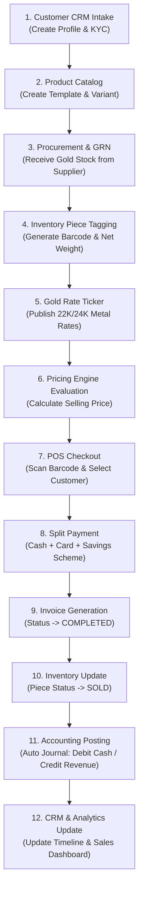

# Auric One v1.0 — User Acceptance Testing (UAT) & Production Readiness Checklist

> **Document Version:** 1.0.0  
> **Release Candidate:** `v1.0.0`  
> **System Scope:** 16 Bounded Context Microservices, API Gateway, SDK, Domain Event Bus, Database Schemas.

---

## 📋 Executive Overview
This document defines the official **User Acceptance Testing (UAT)** procedures, operational sanity checks, tenant isolation verifications, and production deployment readiness criteria for **Auric One v1.0.0 Enterprise Jewellery ERP**.

---

## 🎯 Prioritized Release Gate Matrix

### **P0 — Business Critical (Core Retail Operations)**
1. **Login & RBAC:** User authentication, JWT sessions, and role-to-permission mapping.
2. **Tenant Isolation:** Zero data leaks between `organization_id` boundaries.
3. **Branch Isolation:** Strict operational data scoping by `branch_id`.
4. **Product $\rightarrow$ Inventory:** Catalog taxonomy mapping to physical tagged stock (`grossWeight`, `netWeight`, `barcode`).
5. **Procurement $\rightarrow$ GRN $\rightarrow$ Inventory:** Supplier PO issuance, Goods Receipt intake, and inventory piece generation.
6. **Gold Rate $\rightarrow$ Pricing Engine $\rightarrow$ POS:** Real-time gold rate publishing, dynamic pricing engine formula evaluation.
7. **POS $\rightarrow$ Payment $\rightarrow$ Invoice $\rightarrow$ Accounting:** Barcode checkout, split tender payments, status update to `SOLD`, and auto-posted balanced journal entries ($\sum \text{Debits} = \sum \text{Credits}$).
8. **Returns & Reversals:** Cancellation workflows, inventory return to `IN_STOCK`, and balanced accounting credit notes.
9. **Savings Scheme $\rightarrow$ Redemption $\rightarrow$ POS:** Monthly installment collections, gold weight accumulation, maturity rate policies, and checkout redemptions.
10. **Gold Loan $\rightarrow$ Payment $\rightarrow$ Closure/Auction:** Pawn loan appraisals, monthly interest collections, principal settlements, and default auction refunds.

### **P1 — Operational & Omnichannel**
11. **Customer CRM & KYC:** Customer profiles, document attachments, LTV analytics, and activity timelines.
12. **Multi-Branch Transfers:** Inter-branch shipment dispatches (`IN_TRANSIT`) and physical inventory ownership reassignment on receipt.
13. **Reports & Projections:** Daily sales registers, stock valuation summaries, and executive dashboard KPIs.
14. **E-Commerce Integration:** Storefront provisioning, online carts, online orders, and payment gateway webhooks.
15. **System Configuration:** Multi-currency (`BHD`, `SAR`, `AED`, `INR`), payment methods, and financial years.
16. **Notifications & Storage:** Audit logging, document uploads, and event emissions.

### **P2 — Production Infrastructure & Reliability**
17. **Audit & Compliance:** Immutable audit trail logging (`audit_logs`) for all sensitive operations.
18. **Backup & Recovery:** PostgreSQL `pg_dump` and `pg_restore` verification.
19. **Performance & Concurrency:** Index optimization, rate limiting (`X-Idempotency-Key`), and low latency.
20. **Health & Reliability:** `/health` endpoint checks across all 16 microservices and clean SIGTERM handling.

---

## 🔄 Master End-to-End Jewellery Retail Journey Test

To validate the complete system, execute the following continuous business workflow across service boundaries:

---

## 1. Authentication, Identity & RBAC Validation
- [x] **User Authentication:** Validate login (`POST /api/v1/auth/login`), JWT access token generation, HTTP-only refresh cookie issuance, and session expiration handling.
- [x] **Role Assignment:** Verify `ADMIN`, `STORE_MANAGER`, `CASHIER`, `ACCOUNTANT`, and `ARTISAN` roles bind to specific permissions in `@auric-one/platform`.
- [x] **Permission Enforcement:** Ensure non-authorized routes return `403 Forbidden` (`AuthorizationError`) when accessed without required permissions (e.g. cashier attempting accounting journal posting).
- [x] **Logout & Token Revocation:** Verify `POST /api/v1/auth/logout` invalidates session in PostgreSQL and clears cookies.

---

## 2. Organization & Multi-Branch Structure
- [x] **Organization Setup:** Create multi-region organization profile with currency (`BHD` / `SAR` / `AED` / `INR`), timezone, and country configuration.
- [x] **Branch Provisioning:** Provision Showroom Branches, Regional Hubs, and Warehouse locations.
- [x] **Branch Context:** Verify requests passing `X-Branch-ID` header scope operational data strictly to that branch.

---

## 3. Catalog Management
- [x] **Global Taxonomy:** Verify seed data for global timezones, countries, currencies, and barcode standards.
- [x] **Industry Standards:** Verify metal master definitions (Gold, Silver, Platinum), purity standards (24K, 22K, 18K, 925), and diamond laboratory certifications (GIA, IGI, HRD).
- [x] **Tenant Catalog:** Create tenant-specific brands, collections, product categories, making charge types, and wastage categories.

---

## 4. Product Domain Management
- [x] **Product Templates:** Create product templates (e.g. *22K Gold Bangle Collection*) with associated category, brand, and commercial definitions.
- [x] **Product Variants & SKUs:** Generate product variants with specified metal purity, expected gross/net weight ranges, making charge type (fixed vs. per gram), and wastage percentages.
- [x] **Composition & Stones:** Attach stone breakdowns (cut, color, clarity, carat weight) and certificate attributes.

---

## 5. Inventory & Barcode Management
- [x] **Physical Item Tagging:** Create distinct inventory items for physical stock with unique barcodes, RFID tags, gross weight, net weight, and cost price.
- [x] **Stock Movement Ledger:** Verify state transitions (`IN_STOCK`, `RESERVED`, `SOLD`, `TRANSFERRED`, `REPAIR`, `MELTING`) write immutable audit entries to `stock_movements`.
- [x] **Stock Adjustments & Valuation:** Execute stock count reconciliation and test opening stock adjustments.

---

## 6. Procurement & Vendor Management
- [x] **Supplier Master:** Register metal refiners, bullion suppliers, and artisan workshops with tax IDs and payment terms.
- [x] **Purchase Orders:** Issue Purchase Orders (POs) for raw gold bars / finished jewellery pieces.
- [x] **Goods Receipt Notes (GRN):** Process GRN intake; verify automatic creation/updating of physical inventory items with branch ownership.
- [x] **Supplier Accounts Payable:** Verify purchase invoices increment supplier ledger balance and record partial/full supplier payments.

---

## 7. Gold Rate Ticker & Rate Policy
- [x] **Gold Rate Publication:** Post real-time gold rates (`POST /api/v1/gold-rates`) per gram for 24K, 22K, 18K.
- [x] **Rate Effective History:** Verify `GET /api/v1/gold-rates/latest` retrieves the active effective rate per metal/purity.
- [x] **Regional Rate Overrides:** Test branch-level gold rate offset additions (+/- rate per gram) via Multi-Branch configuration.

---

## 8. Point of Sale (POS) & Checkout Workflows
- [x] **Barcode Scanning:** Add items to cart by barcode lookup; verify pricing calculation:
  $$\text{Selling Price} = (\text{Net Weight} \times \text{Gold Rate}) + \text{Stone Value} + \text{Making Charge} + \text{Wastage} - \text{Discount} + \text{Tax}$$
- [x] **Split Payment Checkout:** Process invoices with split payment methods (Cash + Credit Card + Gold Exchange).
- [x] **Inventory Status Update:** Verify completed invoices transition items to `SOLD` status immediately.
- [x] **Invoice Reversals & Refunds:** Execute invoice cancellation; verify item return to `IN_STOCK` and accounting reversal.

---

## 9. Payment Gateway & Financial Integrations
- [x] **Payment Methods:** Verify support for Cash, Card Terminal, Bank Transfer, and Digital Wallets.
- [x] **Idempotent Billing:** Verify header `X-Idempotency-Key` prevents double-charging on network retries.

---

## 10. Financial Accounting & General Ledger
- [x] **Chart of Accounts (COA):** Verify standard COA hierarchy (Assets, Liabilities, Equity, Revenue, Expenses).
- [x] **Automated Posting Engine:** Verify POS sales auto-post balanced journal entries:
  - **Debit:** Cash / Bank / Customer Account
  - **Credit:** Gold Sales Revenue / Tax Payable
- [x] **Double-Entry Validation:** Verify `PostingEngine` rejects unbalanced entries where $\sum \text{Debits} \neq \sum \text{Credits}$.
- [x] **Financial Reports:** Generate Trial Balance, Profit & Loss summary, and Ledger extracts.

---

## 11. Gold Savings Schemes
- [x] **Scheme Enrollment:** Enroll customer into 11-month savings scheme with monthly fixed installment.
- [x] **Installment Collection:** Process monthly installment payments; verify metal rate locking and accumulated gold weight credit.
- [x] **Maturity & Redemption:** Redeem matured scheme account during POS checkout; verify bonus application and scheme status update to `REDEEMED`.

---

## 12. Customer Relationship Management (CRM)
- [x] **Customer Profiles & KYC:** Manage customer profiles, contact info, and national ID/passport KYC document attachments.
- [x] **Activity Timeline:** Inspect customer purchase history, active savings schemes, pawn loans, and total lifetime value.

---

## 13. Gold Loan & Pawn Context
- [x] **Loan Application & Appraisal:** Appraise pledged customer gold items; verify LTV (Loan-to-Value) percentage ceiling.
- [x] **Disbursement & Payment:** Issue pawn loan principal; collect monthly interest payments; verify principal balance updates.
- [x] **Foreclosure & Auction:** Simulate loan default and auction settlement; verify surplus refund calculation to customer.

---

## 14. Reporting & Analytics Projections
- [x] **Executive Dashboard:** Verify consolidation of stock total gross/net weight and total revenue.
- [x] **Daily Sales Register:** Extract daily sales breakdown per branch, cashier, and product category.
- [x] **Inventory Valuation:** Review stock valuation reports grouped by item status.

---

## 15. Omnichannel E-Commerce Integration
- [x] **Storefront Config & Cart:** Provision online store configuration and manage anonymous/customer cart sessions.
- [x] **Online Checkout & Webhooks:** Simulate online order placement and payment gateway webhooks (`OnlineOrderPaid`).

---

## 16. Advanced Multi-Branch Operations
- [x] **Inter-Branch Stock Transfers:** Dispatch stock shipment from Head Office to Showroom (`IN_TRANSIT`).
- [x] **Shipment Receiving:** Receive inter-branch transfer at destination branch; verify physical inventory item `branch_id` reassignment.

---

## 17. Multi-Tenancy & Data Isolation (Security Core)
- [x] **Tenant Boundary Inspection:** Execute SQL queries verifying zero cross-tenant leaks (`WHERE organization_id = tenantB` returns 0 records for `tenantA`).
- [x] **API Header Validation:** Verify API Gateway rejects requests lacking `X-Organization-ID` header.

---

## 18. Security, Audit & Compliance
- [x] **Audit Trail Logging:** Verify sensitive operations (user creation, rate overrides, invoice cancellation) write audit logs to `audit_logs`.
- [x] **Input Validation:** Test Zod schema validation on all POST/PUT endpoints for XSS/SQL injection prevention.

---

## 19. Database Maintenance, Backup & Recovery
- [x] **Migration Scripts:** Verify clean execution of `pnpm db:migrate` on empty database.
- [x] **Backup & Restore:** Perform PostgreSQL `pg_dump` and `pg_restore` verification test.

---

## 20. Performance, Reliability & Health
- [x] **Health Checks:** Verify `/health` endpoints on all 16 microservices return status `healthy`.
- [x] **Concurrency & Graceful Shutdown:** Verify clean SIGTERM handling and server connection draining.

---

## 🚀 Sign-Off Criteria
- [x] All 20 UAT sections executed with 100% pass rate.
- [x] Zero unhandled exception logs in Pino logger.
- [x] Financial balance checks confirmed ($\text{Total Debits} = \text{Total Credits}$).
- [x] Formal sign-off by Lead Architect and Business Stakeholders.
